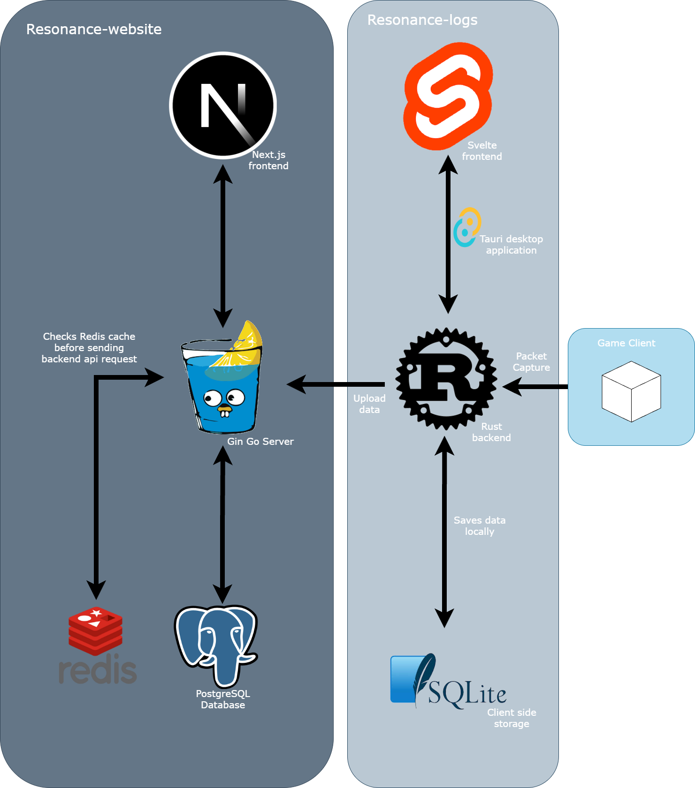

# Resonance Logs

[](https://discord.gg/aPPHe8Uq8Q)

[](https://github.com/resonance-logs/resonance-website/blob/main/LICENSE) [](https://github.com/resonance-logs/resonance-website/issues) [](https://github.com/resonance-logs/resonance-website/stargazers)

> **Live Website:** [bpsr.app](https://bpsr.app/)  
> **Desktop App:** [resonance-logs](https://github.com/resonance-logs/resonance-logs)

---

## Overview

Resonance Logs is a comprehensive combat log analysis platform for **Blue Protocol: Star Resonance**. Explore combat logs, leaderboards, and community-shared encounters with detailed performance analytics.

### Key Features

- **Leaderboards & Rankings** - Browse top encounters and player performances
- **Detailed Analytics** - Inspect encounter pages with performance breakdowns
- **Class Statistics** - View class and specialization performance data
- **Combat Analysis** - Upload encounters from desktop app for community sharing
- **Beautiful UI** - Modern, responsive design built with Next.js

---

## Quick Start

### For Players
1. Visit [**bpsr.app**](https://bpsr.app/) to explore encounters
2. Download the [desktop app](https://github.com/resonance-logs/resonance-logs) to upload your logs
3. Join our [Discord community](https://discord.gg/aPPHe8Uq8Q) for support

### For Developers
1. Clone the repository: `git clone https://github.com/resonance-logs/resonance-website.git`
2. Navigate to the app directory: `cd app`
3. Install dependencies: `npm install`
4. Start development server: `npm run dev`
5. Open [http://localhost:3000](http://localhost:3000)

---

## Tech Stack



**Frontend:**
- **Next.js 14** - React framework with App Router
- **Tailwind CSS** - Utility-first CSS framework
- **React Query** - Data fetching and state management
- **shadcn/ui** - Modern UI component library

**Backend:**
- **Go** - High-performance backend server
- **GORM** - Object-relational mapping
- **Redis** - Caching and session management
- **Gin** - HTTP web framework

**Core Technologies:**
[](https://reactjs.org/) [](https://nextjs.org/) [](https://golang.org/) [](https://github.com/gin-gonic/gin) [](https://www.postgresql.org/) [](https://redis.io/)

---

## Architecture

```
resonance-website/
├── app/                    # Next.js frontend application
│   ├── src/
│   │   ├── api/           # API client functions
│   │   ├── components/    # React components
│   │   ├── types/         # TypeScript definitions
│   │   └── utils/         # Utility functions
│   └── public/            # Static assets
├── server/                # Go backend server
│   ├── controller/        # API controllers
│   ├── routes/            # Route definitions
│   ├── models/           # Database models
│   └── middleware/       # Authentication & middleware
├── scripts/              # Build and deployment scripts
└── docs/                # Documentation
```

---

## Related Projects

### [Resonance Logs Desktop App](https://github.com/resonance-logs/resonance-logs)
A cross-platform desktop application that records live combat encounters and uploads them to the web platform for analysis and sharing.

**Features:**
- Real-time combat log recording
- Automatic upload to resonance-website
- Local data storage and management
- Background synchronization

---

## Contributing

We welcome contributions! Please see our [Contributing Guidelines](CONTRIBUTING.md) for details.

### Development Setup
1. Fork the repository
2. Create a feature branch: `git checkout -b feature/amazing-feature`
3. Commit your changes: `git commit -m 'Add amazing feature'`
4. Push to the branch: `git push origin feature/amazing-feature`
5. Open a Pull Request

---

## Community & Support

- **Website:** [bpsr.app](https://bpsr.app/)
- **Discord:** [Join our community](https://discord.gg/aPPHe8Uq8Q)
- **Issues:** [GitHub Issues](https://github.com/resonance-logs/resonance-website/issues)
- **Documentation:** [Wiki](https://github.com/resonance-logs/resonance-website/wiki)

---

## License

This project is licensed under the MIT License - see the [LICENSE](LICENSE) file for details.

---

## Acknowledgments

Special thanks to these amazing projects and communities:

- [PotRooms/StarResonanceData](https://github.com/PotRooms/StarResonanceData) - Blue Protocol data resources
- [snoww/loa-logs](https://github.com/snoww/loa-logs) - Inspiration for combat log analysis
- Blue Protocol community - For feedback and testing
- All contributors who helped make this project possible

---

<div align="center">

**Star this repository if you find it helpful!**

Made with love by the Resonance Logs team

</div>
