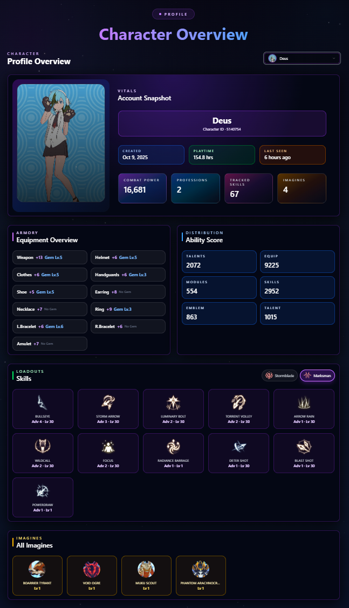
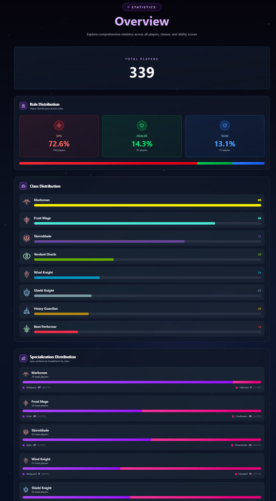

# Resonance Logs

 

> **Live Website:** [bpsr.app](https://bpsr.app/)  
> **Desktop App:** [resonance-logs](https://github.com/resonance-logs/resonance-logs)

---

## Overview

Resonance Logs is a comprehensive combat log analysis platform for **Blue Protocol: Star Resonance**. Explore combat logs, leaderboards, and community-shared encounters with detailed performance analytics.

### Key Features

- **Leaderboards & Rankings** - Browse top encounters and player performances
- **Detailed Analytics** - Inspect encounter pages with performance breakdowns
- **Class Statistics** - View class and specialization performance data
- **Combat Analysis** - Upload encounters from desktop app for community sharing
- **Beautiful UI** - Modern, responsive design built with Next.js

---

## Quick Start

### For Players
1. Visit [**our website**](https://bpsr.app/get-started) to get started
2. Download the [desktop app](https://github.com/resonance-logs/resonance-logs) to upload your logs

---

## Images

---

## Tech Stack

**Core Technologies:**
     

---

## Community & Support

- **Website:** [bpsr.app](https://bpsr.app/)
- **Discord:** [Join our community](https://discord.gg/aPPHe8Uq8Q)

---

## Acknowledgments

Special thanks to these amazing projects and communities:

- [PotRooms/StarResonanceData](https://github.com/PotRooms/StarResonanceData) - Blue Protocol data resources
- [snoww/loa-logs](https://github.com/snoww/loa-logs) - Inspiration for combat log analysis

---

## License

This project is licensed under the MIT License - see the [LICENSE](LICENSE) file for details.
